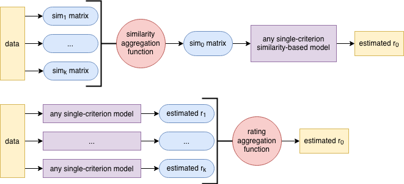

# An Evaluation of Multi-Criteria Recommendation Techniques

## Contact information

- Name: Ariel Martínez Silberstein
- University: Pontifical Catholic University of Chile (Santiago, Chile)
- Email: amartinez5@uc.cl

## Abstract

Although multi-criteria rating systems —in which the rating is composed of a vector along several criteria— are being commonly employed in the industry, recommendation systems that use them correspond to a largely unexplored area. Several reviews show that multi-criteria ratings can be leveraged to produce better personalized recommendations, as compared to traditional techniques. However, much additional work is needed to make significant improvements. To this end, in this paper, we empirically test out two different multi-criteria recommendation models in order to evaluate their rating estimation performance. Our results do not conclude any improvement. Nevertheless, they can be considered as one more step towards the science of understanding the underlying value of multi-criteria ratings.

## Important directories and files

- [`docs/paper/`](docs/paper/): the paper.
- [`knn/__init__.py`](knn/__init__.py): the multi-criteria KNN implementation.
- [`knn/similarity.py`](knn/similarity.py): the similarity metrics used in this work.
- [`utils.py`](utils.py): some useful functions used by the program.
- [`main.ipynb`](main.ipynb): a demonstration of the set of experiments mentioned in the paper (not run).

## Requirements

- [Python](https://www.python.org/) 3.7.
- [Jupyter](https://jupyter.org/) 4.4.
- The external packages stated in the [`Pipfile`](Pipfile).

The code is intended to work with the versions stated above and has not been tested with previous ones.

## Copyright

Check out the [`LICENSE`](LICENSE).
